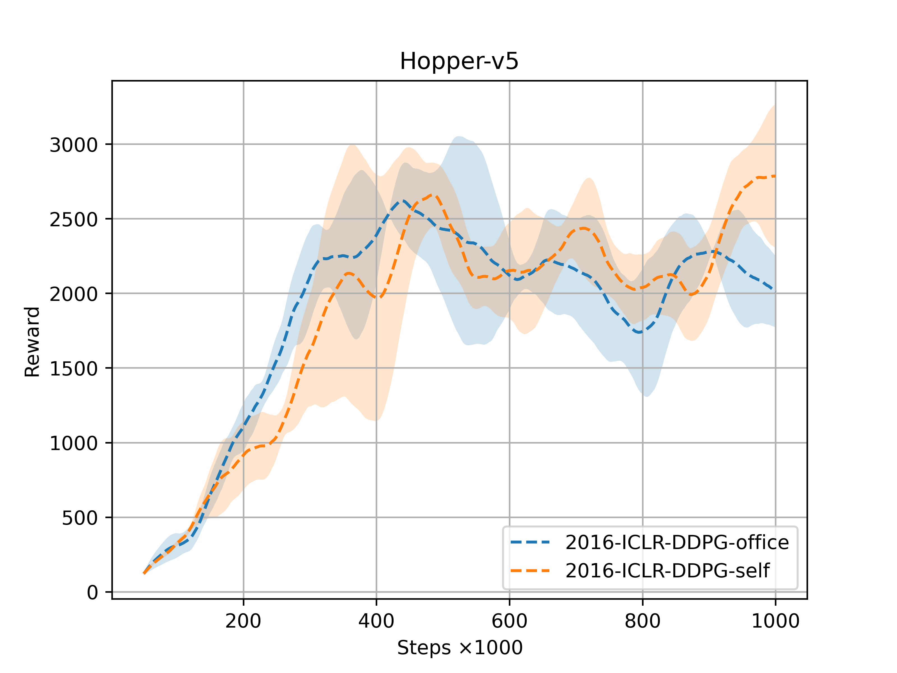
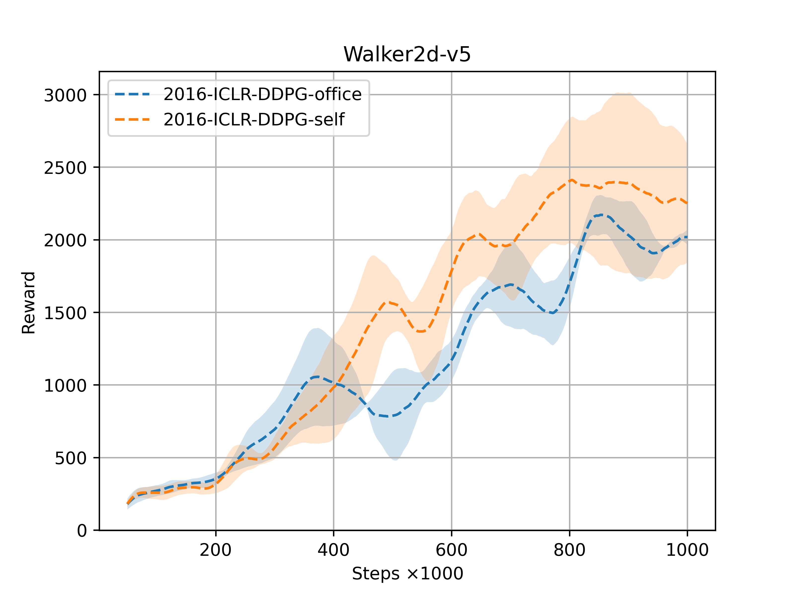
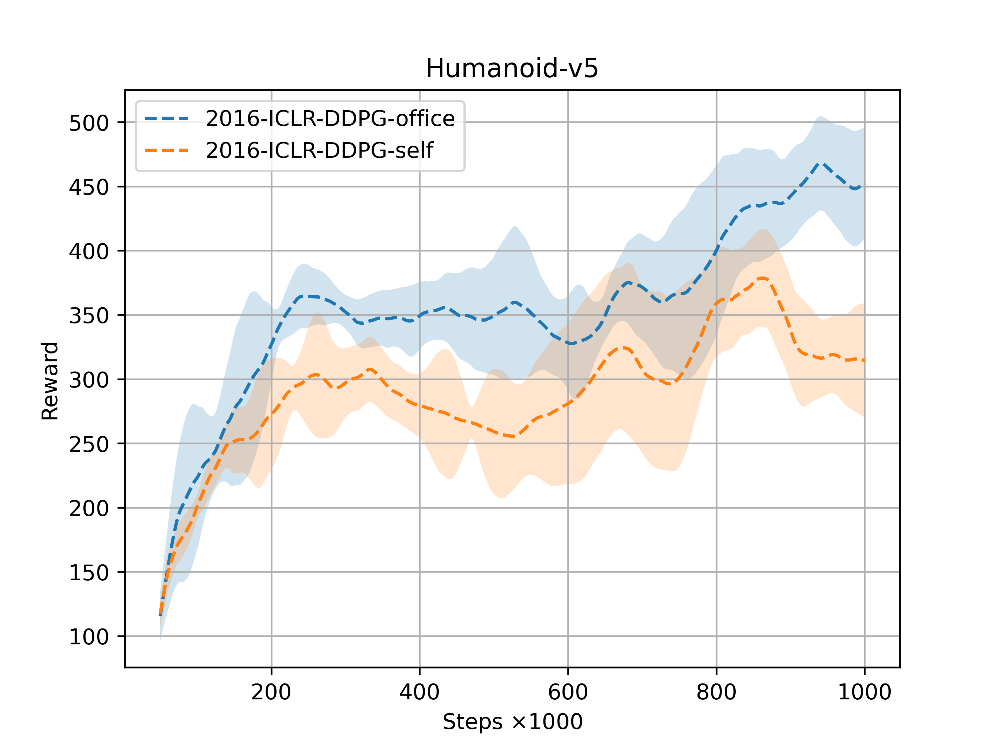
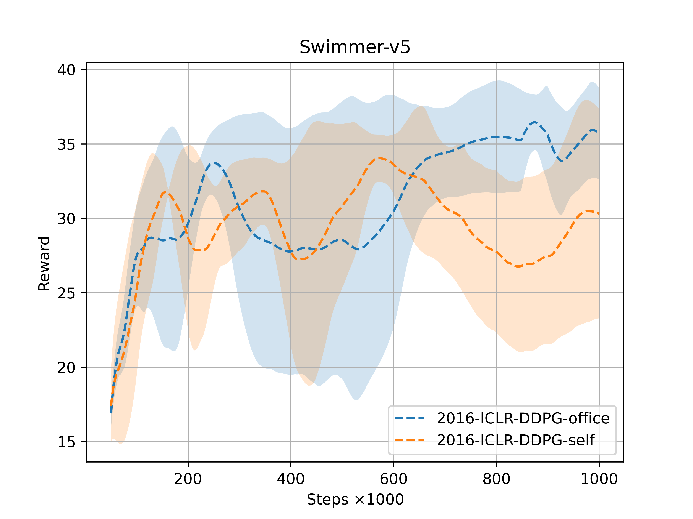
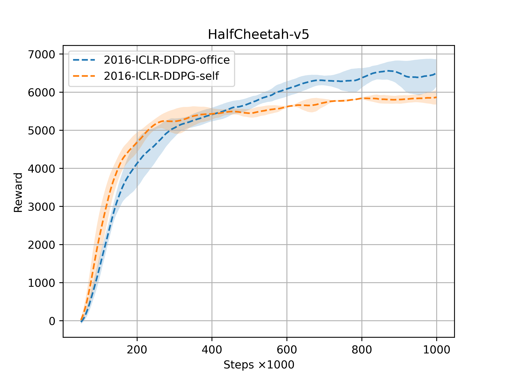
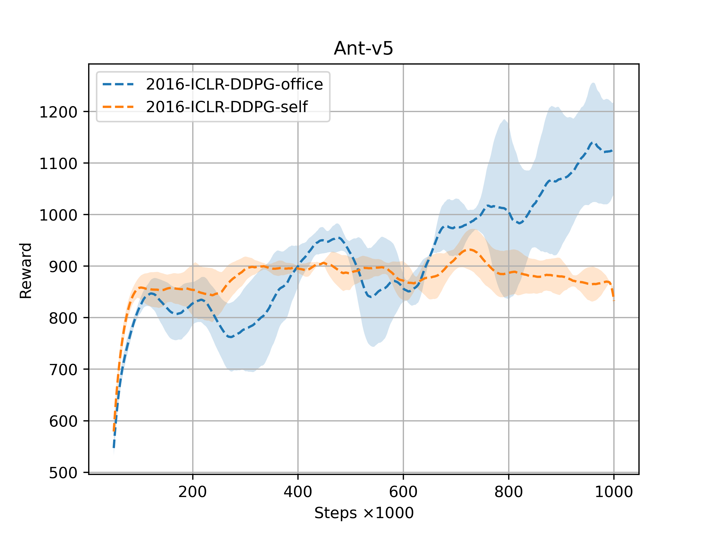

# 2016-ICLR-DDPG-Technical Scheme and Lab Report

## 2016-ICLR-DDPG-Introduction 

$\color{orange} (DDPG)$. An efficient, off-policy, actor-critic, and model-free DRL algorithm that leverages the advantages of DPG and DQN, utilizes neural network approximators, and is capable of handling high-dimensional and continuous action spaces.

| Component                   | description                                                  |
| --------------------------- | ------------------------------------------------------------ |
| Replay Buffer $\mathcal{D}$ | $D.capacity = 1e6$;    $batch\_size=64$.                     |
| Actor                       | Deterministic Policy: $\mu_{\theta^{\mu}}: a = \mu(s)$;  Behavioral Policy: $\beta = \mu + noise \sim \mathcal{N}(0,0.1\times action\_max)$. |
| Critic                      | $Q_{\theta^{Q}}: Q = Q(s,a)$.                                |
| Batch Normalization         | $BN$ Layer                                                   |

​	 DDPG interacts with the environment by constructing a behavior policy: 
$$
\mu'(s_t) = \mu(s_t | \theta_t^{\mu}) + \mathcal{N}
$$
where $\mathcal{N}$ depends on the environment.

​	DDPG requires the updating of three fundamental components: the actor, the critic, and the target networks.

The action-value function, the critic, employs a loss function similar to that of DQN:
$$
L( \theta ^Q ) = \mathbb{E}_{s_t \sim \rho^{\beta} , a_t \sim \beta , r_t \sim E} [ \big(  Q(s_t, a_t | \theta ^Q)  - y_t \big)^2 ]， \quad y_t =  r(s_t , a_t) + \gamma Q(s_{t+1} , \mu (s_{t+1}) | \theta ^Q)
$$
The policy (actor) employs a loss function similar to that of DPG:
$$
J \approx E_{s_t \sim \rho^{\beta}} \Big[  Q(s,a|\theta^{Q})|_{s=s_t,a= \mu(s_|\theta^{\mu})}  \Big]
$$
The target networks are updated using soft updates:
$$
\theta '  \leftarrow \tau \theta + (1 - \tau) \theta',	\quad  \ \tau=0.001 \ll 1
$$
This report primarily demonstrates

| 类型                                                         | 内容                                                         |
| ------------------------------------------------------------ | ------------------------------------------------------------ |
| DDPG-Introduction                                            | The core components of DDPG are introduced, including its definition, action sampling mechanism, and loss functions. |
| DDPG Reproduction                                            | Reproduced and improved the DDPG algorithm based on the official code. |
| Experiments: Performance Analysis of DDPG in MuJoCo Environments | Comparing DDPG-officevs. DDPG-self on MuJoCo Tasks           |
| Ablation Study and Hyperparameter Sensitivity of DDPG on MuJoCo | Analysis of key hyperparameters for DDPG-self: (1) Learning Rate; |

- $\color{red} Q : $ Performance Analysis: How does DDPG-self compare to the official implementation (DDPG-office)? [Performance]
- $\color{red}Q:$ Impact of Large Models on DDPG-self Performance under Large-scale Parameter Settings? [Large Model]
- $\color{red} Q:$ An Empirical Study on Learning Rate Sensitivity for DDPG-self? [learning Rate]

## 2016-ICLR-DDPG-Experiment

### Experimental Setup

​	Experiments are conducted in MuJoCo, a high-dimensional and continuous action control benchmark for robotic tasks. Specifically, we evaluate the algorithm on Hopper, Walker2d, Humanoid, Swimmer, HalfCheetah, and Ant, as shown in the following figure:

    <figure style="flex: 1;">
        <video src="./assets/Hopper-v5.mp4" width="90%" controls autoplay loop oncontextmenu="return false;" ondragstart="return false;"></video>
        <figcaption>MuJoCo-Hopper</figcaption>
    </figure>
    <figure style="flex: 1;">
		<video src="./assets/Walker2d-v5.mp4" width="90%" controls autoplay loop oncontextmenu="return false;" ondragstart="return false;"></video>
		<figcaption>MuJoCo-Walker2d</figcaption>
	</figure>
    <figure style="flex: 1;">
        <video src="./assets/Humanoid-v5.mp4" width="90%" controls autoplay loop oncontextmenu="return false;" ondragstart="return false;"></video>
        <figcaption>MuJoCo-Humanoid</figcaption>
    </figure>
    <figure style="flex: 1;">
		<video src="./assets/Swimmer-v5.mp4" width="90%" controls autoplay loop oncontextmenu="return false;" ondragstart="return false;"></video>
		<figcaption>MuJoCo-Swimmer</figcaption>
	</figure>
    <figure style="flex: 1;">
        <video src="./assets/HalfCheetah-v5.mp4" width="90%" controls autoplay loop oncontextmenu="return false;" ondragstart="return false;"></video>
        <figcaption>MuJoCo-HalfCheetah</figcaption>
    </figure>
    <figure style="flex: 1;">
		<video src="./assets/Ant-v5.mp4" width="90%" controls autoplay loop oncontextmenu="return false;" ondragstart="return false;"></video>
		<figcaption>MuJoCo-Ant</figcaption>
	</figure>

The hyperparameter settings for DDPG are as follows:

| DDPG Hyperparameters           | Value                                                        |
| ------------------------------ | ------------------------------------------------------------ |
| Learning Rate                  | $a\_lr=1e-4,\ q\_lr=1e-3$                                    |
| Q-Critic L2 weight decay       | $1e-2$                                                       |
| Activation Function            | $ReLU$                                                       |
| Number of Hidden Units         | $256$                                                        |
| Weight Initialization          | The weights are initialized using a uniform distribution within the range $[-\frac{1}{\sqrt{f}}, \frac{1}{\sqrt{f}}]$, where $f$ denotes the fan-in (number of input units). |
| Discount Factor $\gamma$       | $0.99$                                                       |
| Soft Update Coefficient $\tau$ | $0.001$                                                      |
| Replay Buffer Size             | $10^6$                                                       |
| Batch Size                     | $256$                                                        |

### Performance Analysis of DDPG

#### Performance Analysis of DDPG on MuJoCo

    <figure style="flex: 1;">
        
        <figcaption>MuJoCo:Hopper</figcaption>
    </figure>
    <figure style="flex: 1;">
		
		<figcaption>MuJoCo: Walker2d</figcaption>
	</figure>
    <figure style="flex: 1;">
		
		<figcaption>MuJoCo: Humanoid</figcaption>
	</figure>

    <figure style="flex: 1;">
		
		<figcaption>MuJoCo: Swimmer</figcaption>
	</figure>
    <figure style="flex: 1;">
        
		<figcaption>MuJoCo: HalfCheetah</figcaption>
	</figure>
    <figure style="flex: 1;">
        
		<figcaption>MuJoCo: Ant</figcaption>
	</figure>

:golf: **Performance Demonstration of DDPG-office**

    <figure style="flex: 1;">
        <video src="./assets/Hopper-v5-DDPG-office.mp4" width="90%" controls autoplay loop oncontextmenu="return false;" ondragstart="return false;"></video>
        <figcaption>MuJoCo-Hopper DDPG-office</figcaption>
    </figure>
    <figure style="flex: 1;">
        <video src="./assets/Walker2d-v5-DDPG-office.mp4" width="90%" controls autoplay loop oncontextmenu="return false;" ondragstart="return false;"></video>
        <figcaption>MuJoCo-Walker2d DDPG-office</figcaption>
    </figure>
    <figure style="flex: 1;">
        <video src="./assets/Humanoid-v5-DDPG-office.mp4" width="90%" controls autoplay loop oncontextmenu="return false;" ondragstart="return false;"></video>
        <figcaption>MuJoCo-Humanoid DDPG-office</figcaption>
    </figure>
    <figure style="flex: 1;">
        <video src="./assets/Swimmer-v5-DDPG-office.mp4" width="90%" controls autoplay loop oncontextmenu="return false;" ondragstart="return false;"></video>
        <figcaption>MuJoCo-Swimmer DDPG-office</figcaption>
    </figure>
    <figure style="flex: 1;">
        <video src="./assets/HalfCheetah-v5-DDPG-office.mp4" width="90%" controls autoplay loop oncontextmenu="return false;" ondragstart="return false;"></video>
        <figcaption>MuJoCo-HalfCheetah DDPG-office</figcaption>
    </figure>
    <figure style="flex: 1;">
        <video src="./assets/Ant-v5-DDPG-office.mp4" width="90%" controls autoplay loop oncontextmenu="return false;" ondragstart="return false;"></video>
        <figcaption>MuJoCo-Ant DDPG-office</figcaption>
    </figure>

:grinning: **Performance Demonstration of DDPG-self**

    <figure style="flex: 1;">
        <video src="./assets/Hopper-v5-DDPG-self.mp4" width="90%" controls autoplay loop oncontextmenu="return false;" ondragstart="return false;"></video>
        <figcaption>MuJoCo-Hopper DDPG-self</figcaption>
    </figure>
    <figure style="flex: 1;">
        <video src="./assets/Walker2d-v5-DDPG-self.mp4" width="90%" controls autoplay loop oncontextmenu="return false;" ondragstart="return false;"></video>
        <figcaption>MuJoCo-Walker2d DDPG-self</figcaption>
    </figure>
    <figure style="flex: 1;">
        <video src="./assets/Humanoid-v5-DDPG-self.mp4" width="90%" controls autoplay loop oncontextmenu="return false;" ondragstart="return false;"></video>
        <figcaption>MuJoCo-Humanoid DDPG-self</figcaption>
    </figure>
    <figure style="flex: 1;">
        <video src="./assets/Swimmer-v5-DDPG-self.mp4" width="90%" controls autoplay loop oncontextmenu="return false;" ondragstart="return false;"></video>
        <figcaption>MuJoCo-Swimmer DDPG-self</figcaption>
    </figure>
    <figure style="flex: 1;">
        <video src="./assets/HalfCheetah-v5-DDPG-self.mp4" width="90%" controls autoplay loop oncontextmenu="return false;" ondragstart="return false;"></video>
        <figcaption>MuJoCo-HalfCheetah DDPG-self</figcaption>
    </figure>
    <figure style="flex: 1;">
        <video src="./assets/Ant-v5-DDPG-self.mp4" width="90%" controls autoplay loop oncontextmenu="return false;" ondragstart="return false;"></video>
        <figcaption>MuJoCo-Ant DDPG-self</figcaption>
    </figure>

### Hyperparameter Analysis of DDPG

